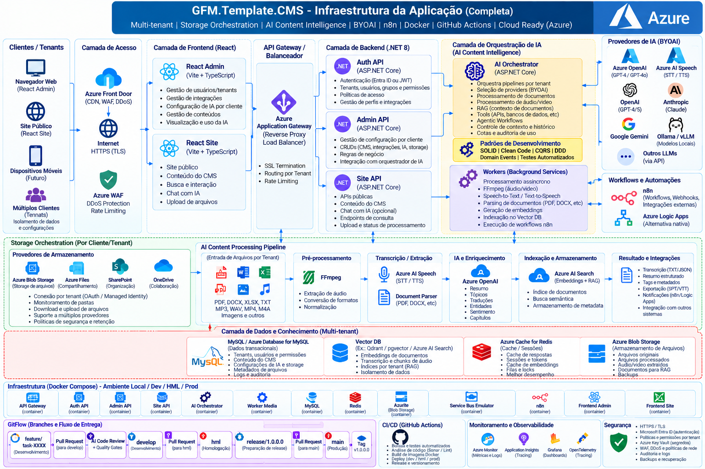
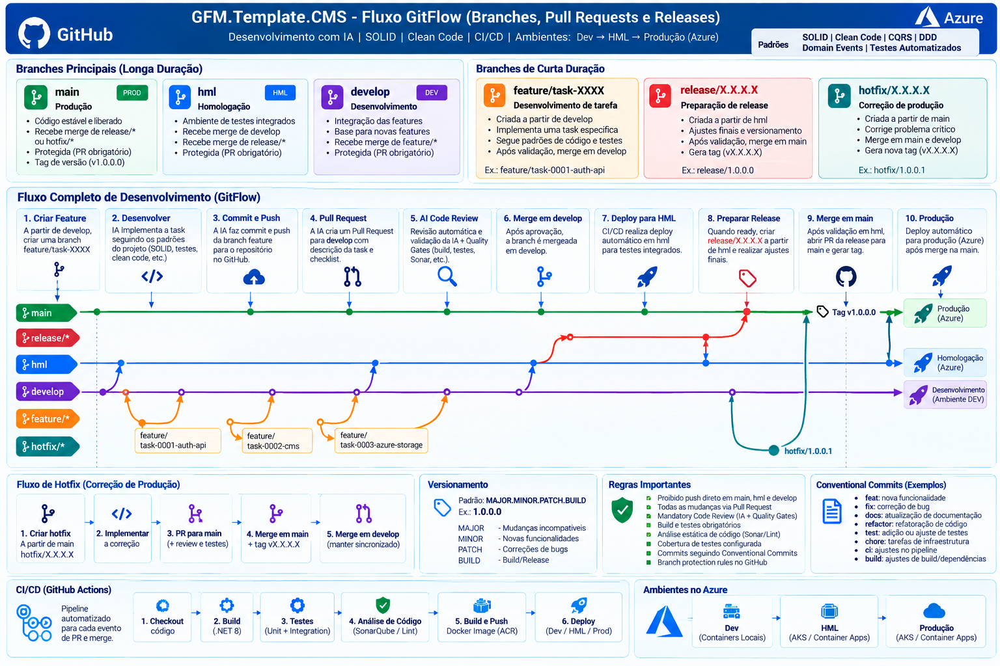
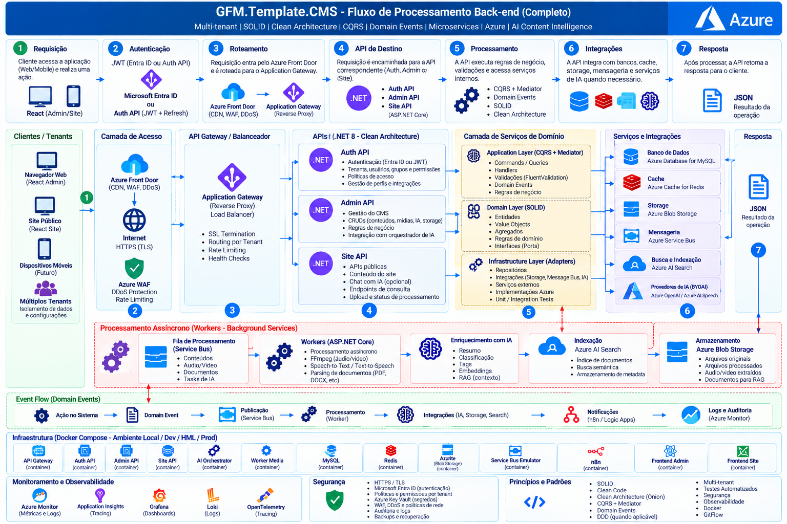
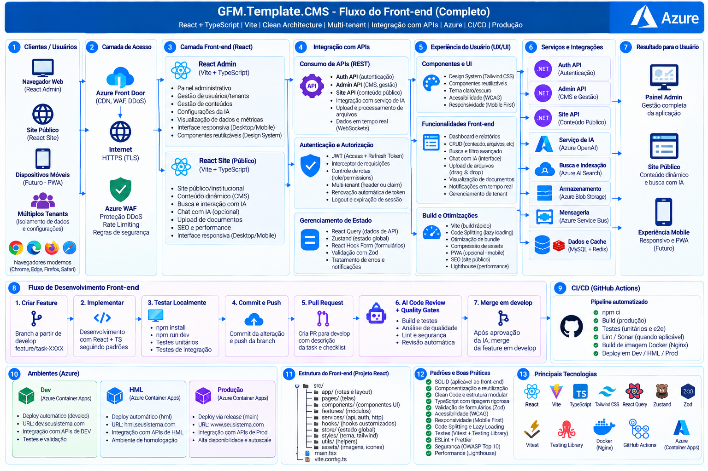

# 📘 Documentação Geral - GFM.Template.CMS

## 📖 Visão Geral

O **GFM.Template.CMS** é um template de aplicação **multi-tenant**,
desenvolvido sobre **ASP.NET Core / .NET, React e tecnologias de
Inteligência Artificial**, preparado para servir como base para
aplicações modernas de gestão de conteúdo, automação e processamento
inteligente de documentos, áudios, vídeos e outros arquivos.

O projeto mantém uma arquitetura modular baseada em **DDD, CQRS, Domain
Events e separação de responsabilidades**, com suporte a processamento
assíncrono, mensageria, cache distribuído, observabilidade, containers e
implantação em cloud.

Além das funcionalidades tradicionais de CMS, autenticação, usuários,
grupos e permissões, o template incorpora uma camada de **AI Content
Intelligence**, permitindo que cada cliente/tenant utilize a IA
disponibilizada pelo servidor ou conecte seus próprios provedores de
Inteligência Artificial através do conceito **BYOAI (Bring Your Own
AI)**.

Os arquivos de cada tenant podem ser armazenados no próprio ambiente da
aplicação ou em provedores configurados pelo cliente, como **Google
Drive, Microsoft OneDrive/SharePoint, Azure Blob Storage, MinIO ou armazenamento
local**.

O processamento inteligente permite recuperar um arquivo do storage
configurado, identificar seu tipo, extrair conteúdo, transcrever
áudio/vídeo, enriquecer as informações com LLMs, indexar conteúdo para
RAG e executar automações através do **n8n**.

------------------------------------------------------------------------

## 🏗 Arquitetura da Aplicação

> O diagrama oficial da arquitetura Azure deve ser gerado na segunda etapa do fluxo de execução, em formato editável Draw.io, conforme `prompts.md` e `PROJECT_STRUCTURE.md`.
> Caminho esperado: `docs/architecture/azure-architecture.drawio`.










### 🔄 Fluxo principal

``` text
Cliente / Tenant
      │
      ▼
React Admin / React Site
      │
      ▼
Azure API Management / Reverse Proxy
      │
      ▼
ASP.NET Core APIs
      │
      ├──────────────► Autenticação / Usuários / Permissões
      │
      ├──────────────► CMS
      │
      ├──────────────► Storage Orchestrator
      │
      └──────────────► AI Content Orchestrator
                             │
               ┌─────────────┼─────────────┐
               ▼             ▼             ▼
             LLM            RAG          Agents
               │             │             │
               └─────────────┼─────────────┘
                             ▼
                     Content Processing
                             │
         ┌───────────────────┼───────────────────┐
         ▼                   ▼                   ▼
     Documentos            Áudio               Vídeo
   PDF/DOCX/XLSX        MP3/WAV/M4A          MP4/etc.
         │                   │                   │
      Parser              FFmpeg              FFmpeg
         │                   │                   │
         │             Speech-to-Text      Extrair áudio
         │                   │                   │
         └───────────────────┼───────────────────┘
                             ▼
                     Conteúdo estruturado
                             │
                    ┌────────┴────────┐
                    ▼                 ▼
               Vector Store          n8n
                    │                 │
                   RAG         Workflows/Webhooks
```

------------------------------------------------------------------------

## 🏗 Arquitetura e Tecnologias Utilizadas

O projeto utiliza uma arquitetura **Modular Monolith preparada para
evolução**, aplicando **DDD (Domain-Driven Design)**, **CQRS (Command
Query Responsibility Segregation)**, **Domain Events**, processamento
assíncrono e abstrações para infraestrutura externa.

A estratégia de infraestrutura segue:

**Local First → Container First → Cloud Ready → Azure Target**

Principais tecnologias e componentes:

-   **ASP.NET Core / .NET** → Backend, APIs e serviços de aplicação
-   **React + Vite + TypeScript** → Frontend administrativo e site
-   **Entity Framework Core** → ORM e persistência relacional
-   **CQRS** → Separação entre comandos e consultas
-   **DDD / Domain Events** → Modelagem de domínio e eventos
-   **Nginx / Reverse Proxy** → Entrada, roteamento e balanceamento
-   **MySQL / SQL Server** → Persistência relacional configurável
-   **MongoDB** → Persistência NoSQL quando necessária
-   **Redis** → Cache distribuído, sessões e otimização de performance
-   **RabbitMQ / Kafka** → Mensageria e processamento assíncrono
-   **Vector Database** → Embeddings, busca semântica e RAG
-   **MinIO / Azure Blob Storage** → Object Storage
-   **Google Drive** → Storage configurável por tenant
-   **OneDrive / SharePoint** → Storage Microsoft configurável por
    tenant
-   **FFmpeg** → Extração, conversão e normalização de áudio/vídeo
-   **Speech-to-Text** → Transcrição de áudio e vídeo
-   **LLMs** → Análise, enriquecimento e geração de conteúdo
-   **RAG** → Recuperação de conhecimento e respostas contextualizadas
-   **Agents / Tools** → Execução de ferramentas e workflows
    inteligentes
-   **n8n** → Automação, webhooks e integrações externas
-   **Docker & Docker Compose** → Contêinerização dos serviços
-   **GitHub Actions** → CI/CD
-   **OpenTelemetry** → Tracing e telemetria
-   **Prometheus** → Métricas
-   **Grafana** → Dashboards
-   **Loki** → Centralização de logs
-   **Swagger / OpenAPI** → Documentação das APIs
-   **JWT + Refresh Token** → Autenticação
-   **Policies / Permissions** → Autorização baseada em políticas
-   **Azure** → Ambiente cloud alvo

------------------------------------------------------------------------

## 🏢 Multi-Tenant

O sistema foi projetado para trabalhar com múltiplos clientes através de
**tenants isolados**.

Cada tenant pode possuir configurações próprias para:

-   usuários, grupos, perfis e permissões;
-   conteúdo CMS;
-   armazenamento;
-   provedores de IA;
-   modelos de IA;
-   embeddings;
-   Speech-to-Text;
-   Text-to-Speech;
-   Vision;
-   RAG;
-   workflows;
-   integrações;
-   quotas e limites;
-   políticas de retenção;
-   auditoria e consumo.

As configurações e dados de um tenant não devem ser compartilhados com
outro tenant.

------------------------------------------------------------------------

## 🤖 BYOAI - Bring Your Own AI

Cada cliente pode decidir utilizar a IA disponibilizada pela plataforma
ou conectar sua própria infraestrutura de Inteligência Artificial.

### Modos disponíveis

``` text
ServerManaged
└── Utiliza os providers configurados pelo servidor.

CustomerManaged
└── Utiliza exclusivamente providers e credenciais do cliente.

Hybrid
├── Utiliza providers do cliente.
└── Pode utilizar providers do servidor como fallback, quando autorizado.
```

### Providers previstos

-   OpenAI
-   Azure OpenAI
-   Anthropic
-   Google Gemini
-   Azure AI Foundry
-   Ollama
-   vLLM
-   endpoints compatíveis com OpenAI
-   providers locais/fake para desenvolvimento e testes

O tenant pode selecionar providers diferentes para cada capacidade:

``` text
Tenant
├── LLM
├── Embeddings
├── Speech-to-Text
├── Text-to-Speech
├── Vision
└── Reranker
```

Credenciais e API Keys **não devem ser armazenadas em texto puro no
banco de dados**. O sistema mantém referências para secrets seguros.

------------------------------------------------------------------------

## 📂 Storage Orchestration

Cada tenant pode definir onde seus arquivos serão armazenados.

### Providers suportados

-   **Google Drive**
-   **Microsoft OneDrive**
-   **Microsoft SharePoint**
-   **Azure Blob Storage**
-   **MinIO**
-   **Local Storage**

O núcleo da aplicação acessa esses providers através de abstrações,
evitando dependência direta do domínio com SDKs externos.

Exemplo conceitual:

``` text
IStorageProvider
├── GoogleDriveStorageProvider
├── OneDriveStorageProvider
├── SharePointStorageProvider
├── AzureBlobStorageProvider
├── MinioStorageProvider
└── LocalStorageProvider
```

Cada tenant pode possuir sua própria conexão, credenciais, pasta raiz,
políticas de sincronização e retenção.

------------------------------------------------------------------------

## 🧠 AI Content Intelligence

A camada **AI Content Intelligence** é responsável por processar
conteúdos independentemente do local onde estão armazenados.

### Tipos de conteúdo previstos

-   PDF
-   DOCX
-   XLSX
-   TXT
-   imagens
-   MP3
-   WAV
-   M4A
-   MP4
-   outros formatos habilitados por configuração

### Pipeline

``` text
Storage Provider
      │
      ▼
Storage Orchestrator
      │
      ▼
Identificação do arquivo
      │
      ├── Documento ─────────► Document Parser
      │
      ├── Áudio ─────────────► FFmpeg ─► Speech-to-Text
      │
      └── Vídeo ─────────────► FFmpeg ─► Speech-to-Text
                                      │
                                      ▼
                                  Transcrição
                                      │
                                      ▼
                               AI Orchestrator
                                      │
                     ┌────────────────┼────────────────┐
                     ▼                ▼                ▼
                    LLM              RAG             Agents
                     │                │                │
                     └────────────────┼────────────────┘
                                      ▼
                              Resultado estruturado
                                      │
                       ┌──────────────┼──────────────┐
                       ▼              ▼              ▼
                   Database       Vector DB         n8n
```

A IA pode gerar:

-   transcrição;
-   resumo;
-   tópicos;
-   capítulos;
-   decisões;
-   tarefas;
-   responsáveis;
-   entidades;
-   palavras-chave;
-   conteúdo estruturado;
-   embeddings;
-   legendas SRT/VTT;
-   dados para RAG.

------------------------------------------------------------------------

## ⚙️ n8n e Automações

O **n8n** é utilizado como camada de automação e integração, mas não
substitui as regras de negócio da aplicação.

Exemplos:

-   detectar novo arquivo;
-   chamar webhook da aplicação;
-   iniciar processamento;
-   enviar notificações;
-   enviar e-mails;
-   integrar sistemas externos;
-   movimentar arquivos processados;
-   disparar processos após análise da IA.

O n8n deve interagir com a aplicação através de **APIs, eventos e
webhooks**, evitando acesso direto aos bancos de dados.

------------------------------------------------------------------------

## 📁 Estrutura do Projeto

``` bash
📂 GFM.Template.CMS
├── 📂 docs
│   ├── 📄 Arquitetura-GFM-Template-CMS.png
│   ├── 📄 AI_CONTENT_INTELLIGENCE.md
│   ├── 📄 AUDIO_INTELLIGENCE.md
│   └── 📄 README.md
│
├── 📂 src
│   ├── 📂 01 - APIs
│   │   ├── 📂 API.Gateway
│   │   ├── 📂 API.Auth
│   │   ├── 📂 API.Admin
│   │   └── 📂 API.Site
│   │
│   ├── 📂 02 - Workers
│   │   └── 📂 Worker.Media
│   │
│   ├── 📂 03 - Application
│   │   └── 📂 GFM.Template.CMS.Application
│   │
│   ├── 📂 04 - Domain
│   │   └── 📂 GFM.Template.CMS.Domain
│   │
│   ├── 📂 05 - Infrastructure
│   │   ├── 📂 Persistence
│   │   ├── 📂 Messaging
│   │   ├── 📂 Storage
│   │   │   ├── 📂 GoogleDrive
│   │   │   ├── 📂 OneDrive
│   │   │   ├── 📂 SharePoint
│   │   │   ├── 📂 Azure Blob Storage
│   │   │   ├── 📂 MinIO
│   │   │   └── 📂 Local
│   │   └── 📂 AI
│   │       ├── 📂 OpenAI
│   │       ├── 📂 AzureOpenAI
│   │       ├── 📂 Anthropic
│   │       ├── 📂 Gemini
│   │       ├── 📂 AzureOpenAI
│   │       ├── 📂 OpenAICompatible
│   │       └── 📂 Local
│   │
│   ├── 📂 06 - Frontend
│   │   ├── 📂 admin
│   │   └── 📂 site
│   │
│   └── 📂 07 - Tests
│       ├── 📂 UnitTests
│       ├── 📂 IntegrationTests
│       └── 📂 ArchitectureTests
│
├── 📂 config
│   └── 📂 examples
│
├── 📂 .github
│   └── 📂 workflows
│       ├── 📄 ci.yml
│       ├── 📄 docker.yml
│       ├── 📄 security.yml
│       └── 📄 deploy.yml
│
├── 📄 docker-compose.yml
├── 📄 docker-compose.override.yml
├── 📄 prompts.md
├── 📄 PROJECT_STRUCTURE.md
├── 📄 PROJECT_SKILLS.md
└── 📄 README.md
```

> A estrutura final pode ser expandida durante a geração do projeto
> conforme os módulos e capacidades habilitados.

------------------------------------------------------------------------

## 📌 Descrição dos Principais Componentes

### 1️⃣ **API.Gateway**

-   Interface de entrada para os clientes.
-   Roteamento das APIs.
-   Rate limiting.
-   SSL termination.
-   Políticas de acesso.
-   Routing por tenant.

### 2️⃣ **API.Auth**

-   Autenticação.
-   JWT + Refresh Token.
-   Usuários.
-   Grupos.
-   Perfis.
-   Permissões.
-   Policies.
-   Identificação do tenant.

### 3️⃣ **API.Admin**

-   Administração do CMS.
-   Gestão de tenants.
-   Gestão de usuários e permissões.
-   Configuração dos Storage Providers.
-   Configuração BYOAI.
-   Gestão de integrações.
-   Configuração de processamento.
-   Auditoria e consumo.

### 4️⃣ **API.Site**

-   APIs públicas.
-   Conteúdo CMS.
-   Consultas.
-   Chat com IA quando habilitado.
-   Upload de arquivos.
-   Consulta do status de processamento.

### 5️⃣ **AI Orchestrator**

-   Seleção do perfil de IA por tenant.
-   Resolução de providers.
-   Prompt Engineering.
-   Structured Output.
-   RAG.
-   Tools.
-   Agents.
-   controle de contexto;
-   fallback autorizado;
-   quotas;
-   auditoria de uso.

### 6️⃣ **Worker.Media**

-   Processamento assíncrono.
-   Download temporário de arquivos.
-   FFmpeg.
-   Speech-to-Text.
-   Parsing de documentos.
-   geração de embeddings;
-   indexação no Vector DB;
-   execução de pipelines;
-   retry;
-   idempotência.

### 7️⃣ **Storage Orchestrator**

-   Resolve o Storage Provider configurado pelo tenant.
-   Localiza arquivos.
-   Realiza download/upload.
-   Gerencia metadados.
-   Permite Google Drive, OneDrive, SharePoint, Azure Blob Storage, MinIO e Local
    Storage.

### 8️⃣ **n8n**

-   Workflows.
-   Webhooks.
-   Integrações.
-   Notificações.
-   Orquestração externa.

------------------------------------------------------------------------

## 🚀 Execução do Projeto

O ambiente local deve poder ser inicializado utilizando **Docker
Compose**.

``` bash
docker compose down
docker compose up -d --build
```

Para executar migrations:

``` bash
dotnet ef database update
```

Providers externos que necessitam credenciais permanecem desabilitados
até serem configurados.

O ambiente local deve possuir providers **Fake/Local** para permitir
desenvolvimento e testes sem dependência obrigatória de serviços pagos.

------------------------------------------------------------------------

### 📡 Serviços Configurados

Os serviços efetivamente iniciados dependem do perfil do Docker Compose.

Serviços previstos:

-   **React Admin**
-   **React Site**
-   **Nginx / Gateway**
-   **API.Auth**
-   **API.Admin**
-   **API.Site**
-   **Worker.Media**
-   **MySQL / SQL Server**
-   **MongoDB**
-   **Redis**
-   **RabbitMQ**
-   **Kafka**
-   **Vector Database**
-   **MinIO**
-   **n8n**
-   **Prometheus**
-   **Grafana**
-   **Loki**
-   **OpenTelemetry**
-   **FFmpeg / Media Processing**

------------------------------------------------------------------------

## 🔍 Testes e Qualidade

### ✅ Testes Unitários

Os testes unitários utilizam **xUnit**.

``` bash
dotnet test
```

Devem existir testes para:

-   Domain;
-   Application;
-   CQRS;
-   validações;
-   policies;
-   tenant isolation;
-   AI Provider Resolver;
-   Storage Provider Resolver;
-   Content Processing Pipeline;
-   BYOAI;
-   fallback;
-   processamento de áudio/documentos.

### 🔄 Testes de Integração

Os testes de integração podem utilizar **Testcontainers**.

``` bash
dotnet test --filter Category=IntegrationTests
```

Devem validar integrações com:

-   banco relacional;
-   Redis;
-   mensageria;
-   Vector DB;
-   MinIO;
-   APIs;
-   workers;
-   providers fake.

### 🏛 Testes de Arquitetura

``` bash
dotnet test --filter Category=ArchitectureTests
```

Os testes devem garantir que:

-   Domain não dependa de Infrastructure;
-   Application não dependa diretamente de SDKs externos;
-   providers sejam acessados através de abstrações;
-   regras multi-tenant sejam preservadas.

------------------------------------------------------------------------

## 📚 Banco de Dados e Conhecimento

### Banco Relacional

Responsável por:

-   tenants;
-   usuários;
-   grupos;
-   permissões;
-   configurações;
-   conteúdo CMS;
-   metadados dos arquivos;
-   configurações de IA;
-   configurações de storage;
-   auditoria;
-   consumo e quotas.

Credenciais devem ser configuradas através de **variáveis de
ambiente/secrets**.

### MongoDB

Disponível para cenários NoSQL que necessitem documentos flexíveis,
histórico ou projeções específicas.

### Vector Database

Responsável por:

-   embeddings;
-   chunks;
-   busca semântica;
-   indexação de documentos;
-   indexação de transcrições;
-   contexto do RAG.

### Redis

Responsável por:

-   cache;
-   sessões;
-   dados temporários;
-   locks distribuídos;
-   otimização de performance.

------------------------------------------------------------------------

## 📦 Mensageria e Streaming

### RabbitMQ

Utilizado para filas e processamento assíncrono quando aplicável.

Exemplos:

-   arquivo recebido;
-   processamento solicitado;
-   transcrição solicitada;
-   documento processado;
-   indexação solicitada.

### Kafka

Disponível para cenários orientados a eventos e streaming com maior
volume.

O uso de RabbitMQ ou Kafka deve ser definido conforme a necessidade do
módulo, evitando utilização desnecessária de ambas as tecnologias no
mesmo fluxo.

------------------------------------------------------------------------

## 🗄 Armazenamento de Arquivos

Arquivos grandes **não devem ser armazenados diretamente no banco
relacional**.

O sistema trabalha com Storage Providers.

``` text
Tenant
  │
  └── Storage Profile
        ├── Google Drive
        ├── OneDrive
        ├── SharePoint
        ├── Azure Blob Storage
        ├── MinIO
        └── Local Storage
```

O banco mantém metadados e referências ao arquivo.

------------------------------------------------------------------------

## 🔐 Segurança

A aplicação deve implementar:

-   HTTPS / TLS;
-   JWT + Refresh Token;
-   Policies e Permissions;
-   isolamento por tenant;
-   Rate Limiting;
-   auditoria;
-   secrets protegidos;
-   proteção de credenciais BYOAI;
-   validação de arquivos;
-   limites de tamanho;
-   MIME types permitidos;
-   políticas de retenção;
-   sanitização de logs;
-   backups.

Credenciais de clientes nunca devem aparecer em logs, traces ou
mensagens.

------------------------------------------------------------------------

## 📊 Observabilidade

A solução prevê:

-   **OpenTelemetry** → tracing distribuído;
-   **Prometheus** → métricas;
-   **Grafana** → dashboards;
-   **Loki** → logs.

O processamento de conteúdo deve permitir rastrear:

``` text
Tenant
→ Arquivo
→ Job
→ Storage Provider
→ AI Provider
→ Modelo
→ Tokens
→ Tempo
→ Resultado
→ Custo
```

------------------------------------------------------------------------

## 🔄 CI/CD - GitHub Actions

O CI/CD oficial do projeto utiliza **GitHub Actions**.

``` text
Push / Pull Request
        │
        ▼
GitHub Actions
        │
        ├── Restore
        ├── Build
        ├── Unit Tests
        ├── Integration Tests
        ├── Architecture Tests
        ├── Security Scan
        ├── Docker Build
        └── Deploy
```

Workflows previstos:

``` text
.github/workflows/
├── ci.yml
├── docker.yml
├── security.yml
└── deploy.yml
```

------------------------------------------------------------------------

## ☁️ Azure Target

O projeto deve funcionar localmente sem Azure, mas permanecer preparado
para implantação cloud.

Mapeamento previsto:

``` text
Local / Docker              Azure
──────────────────────────────────────────
Containers             →   Azure Container Apps / Azure VMs
MinIO                  →   Azure Blob Storage
MySQL                  →   Azure Database for MySQL
Secrets locais         →   Azure Key Vault
Observabilidade        →   Azure Monitor / Application Insights / stack configurada
LLM Server Managed     →   Azure OpenAI / Azure AI Foundry (opcional)
Speech-to-Text         →   Azure AI Speech (opcional)
```

Azure é um **target de implantação**, não uma dependência obrigatória para
desenvolvimento local.

------------------------------------------------------------------------

## 📋 Comandos Importantes

### Restaurar dependências

``` bash
dotnet restore
```

### Compilar

``` bash
dotnet build
```

### Executar testes

``` bash
dotnet test
```

### Criar Migration

``` bash
dotnet ef migrations add InitialCreate
```

### Atualizar banco

``` bash
dotnet ef database update
```

### Subir ambiente

``` bash
docker compose up -d --build
```

### Derrubar ambiente

``` bash
docker compose down
```

### Visualizar containers

``` bash
docker compose ps
```

### Visualizar logs

``` bash
docker compose logs -f
```

------------------------------------------------------------------------

## 🧑‍💻 Autores

-   **Guilherme Figueiras Maurila**

------------------------------------------------------------------------

## 📫 Como me encontrar

[](https://www.youtube.com/channel/UCjy19AugQHIhyE0Nv558jcQ)

[](https://www.linkedin.com/in/guilherme-maurila)

[](mailto:gfmaurila@gmail.com)

# GitFlow, SOLID e Governança de Entrega

Este projeto adota **SOLID** como padrão obrigatório de design e **GitFlow** como fluxo oficial de versionamento e promoção entre ambientes.

## SOLID obrigatório

Toda implementação e revisão deve verificar:

- **SRP — Single Responsibility Principle**: cada classe/módulo possui uma responsabilidade clara;
- **OCP — Open/Closed Principle**: extensões devem evitar alterações desnecessárias em código estável;
- **LSP — Liskov Substitution Principle**: implementações devem respeitar os contratos das abstrações;
- **ISP — Interface Segregation Principle**: interfaces pequenas e específicas, sem contratos genéricos excessivos;
- **DIP — Dependency Inversion Principle**: Domain/Application dependem de abstrações, nunca diretamente de detalhes de Infrastructure.

SOLID é critério obrigatório nos Quality Gates e no AI Code Review. Violações relevantes devem ser corrigidas antes do merge.

## Branches permanentes

```text
main      -> produção
hml       -> homologação
develop   -> desenvolvimento/integração
```

`main`, `hml` e `develop` são protegidas. É proibido implementar diretamente ou fazer push direto nessas branches. Alterações entram por Pull Request.

## Fluxo obrigatório por Task

Cada task deve partir de `develop` e possuir branch própria:

```text
develop
   |
   +--> feature/task-XXXX-descricao
              |
              +--> implementação
              +--> testes
              +--> commit
              +--> push
              +--> Pull Request -> develop
                         |
                         +--> AI Code Review
                         +--> Quality Gates
                         +--> correções, se necessárias
                         +--> merge
```

Convenção: `feature/task-0001-create-auth-api`, `feature/task-0002-user-domain`, `feature/task-0003-azure-blob-storage`.

A IA deve executar `commit` e `push` da branch da task e criar o Pull Request. A IA deve revisar o PR e validar build, testes, arquitetura, SOLID, segurança, qualidade, documentação e impactos antes de permitir o merge.

## Promoção e Release

```text
feature/task-*
      |
      v
   develop
      | PR
      v
     hml
      | homologação aprovada
      v
release/1.0.0.0
      | PR + Quality Gates
      v
     main
      |
      +--> tag v1.0.0.0
      +--> produção
```

A branch `release/MAJOR.MINOR.PATCH.BUILD` deve ser criada a partir do conteúdo homologado em `hml`. Após aprovação, a IA cria PR da release para `main`. Depois do merge, deve criar a tag correspondente e garantir a sincronização necessária com `develop`/`hml`, evitando divergência entre as linhas de desenvolvimento e produção.

Versionamento oficial: `MAJOR.MINOR.PATCH.BUILD`, por exemplo `1.0.0.0`, `1.0.0.1`, `1.0.1.0`, `1.1.0.0`, `2.0.0.0`.

## Hotfix

Correções urgentes de produção usam `hotfix/<versao>-descricao`, partindo de `main`. O hotfix deve passar por PR, AI Code Review e Quality Gates e, após produção, ser sincronizado de volta para `develop` e `hml`.

## Regra de automação da IA

A IA pode operar Git/GitHub para executar o fluxo, mas nunca deve contornar proteção de branch, aprovação obrigatória ou Quality Gate. Quando credenciais/permissões não estiverem disponíveis, deve preparar os commits/branches e informar exatamente a ação externa pendente, sem simular sucesso.

